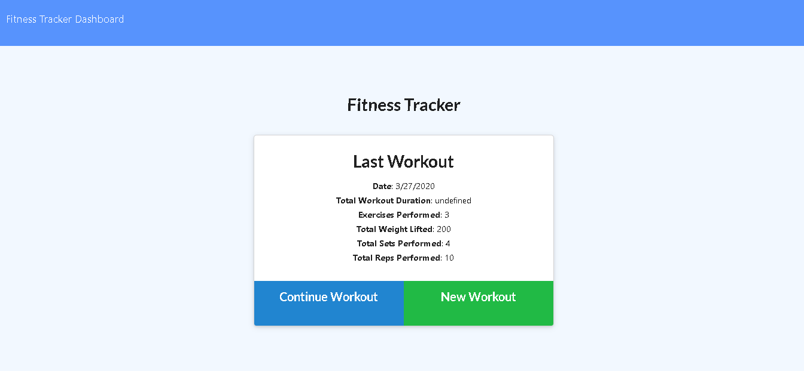
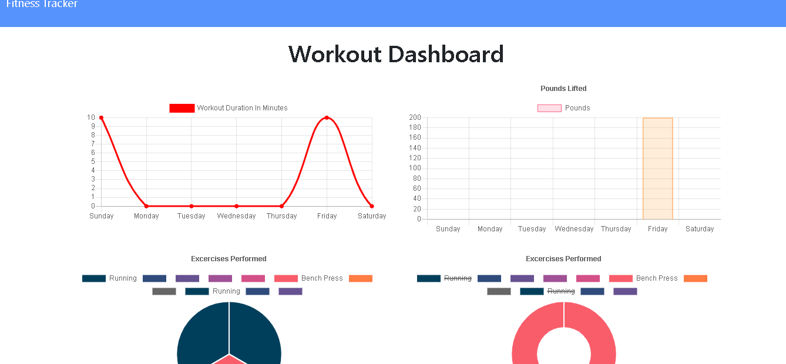

# WorkoutTracker

## Description

This is a application that allows the user to keep track view and create daily workouts. The user can log multiple workouts in a day and keep track of each individual workout by inputing the specific name type of workout, duration, weight used etc. When the user is finished he can see his performance of the day and compare it to other days by using the workout dashbord.
 
[Please check out the launched app on Heroku](https://dry-coast-80362.herokuapp.com/)

## Demo

## Usage 
with this app we are usind nodeJs, MongoDb as a database and mongoose and express as a package to work with it.
This App is running with the help of the Heroku cloud application platform and we used mLab's build in web GUI to manage the database.

## Technologies used

## License

MIT License

Copyright (c) 2020 Paul Fodrovics

